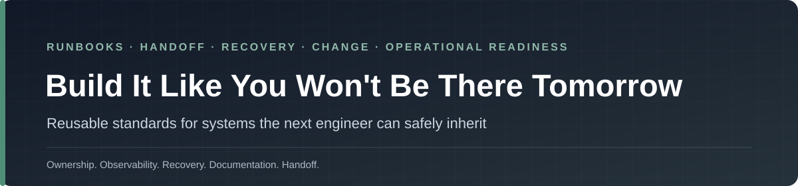

  

  
  

# Build It Like You Won't Be There Tomorrow

> **Personal project notice:** This repository contains independently maintained writing, templates, and general operational guidance. It is not affiliated with, sponsored by, or endorsed by any current or former employer. Examples and templates should remain generic and must not include employer confidential or proprietary information, non-public internal procedures, customer data, credentials, or employer work product.

**Systems should survive the absence of the person who built them.**

This repository turns that idea into reusable operational standards for engineering teams, instructors, students, team leads, and anyone responsible for handing a system to somebody else.

It is intentionally technology-agnostic. The same questions apply whether the system is Windows, Linux, cloud, SaaS, networking, identity, a web application, or a small internal service.

> Documentation is not an obituary written after implementation. It is part of the system.

## Start here

| If you are... | Start with... | Use it for... |
|---|---|---|
| **Engineer building a new system** | [System Runbook](templates/system-runbook.md) | Ownership, purpose, dependencies, access, monitoring, failure modes, and recovery |
| **Engineer handing work to another team** | [Engineering Handoff Checklist](templates/handoff-checklist.md) | Making sure the next operator has what they need before the original builder disappears |
| **Team lead / change approver** | [Production Change Plan](templates/change-plan.md) | Scope, validation, risk, rollback, ownership, and implementation evidence |
| **DR / resilience owner** | [Disaster Recovery Plan](templates/disaster-recovery-plan.md) + [Backup Standard](templates/backup-standard.md) | Recovery assumptions, restore testing, dependencies, and evidence |
| **Incident reviewer** | [Blameless Post-Incident Review](templates/post-incident-review.md) | Timeline, contributing factors, corrective actions, and learning |
| **Security / identity reviewer** | [Privileged Access Review](templates/access-review.md) | Ownership, justification, stale access, review evidence, and follow-up |
| **Monitoring owner** | [Monitoring & Alerting Standard](templates/monitoring-standard.md) | Signal quality, actionable alerts, ownership, thresholds, and escalation |
| **Decommissioning a system** | [Decommission Checklist](templates/decommission-checklist.md) | Data, access, dependencies, DNS, monitoring, backups, documentation, and closure |
| **Instructor / professor** | [Teaching guide](https://github.com/dschunk/dschunk/blob/main/docs/CLASSROOM.md) | Labs, assignments, discussion prompts, and operational-readiness assessment |

## The operational-readiness test

Before calling a system complete, another engineer should be able to answer:

1. **What does it do?**
2. **Why does it exist?**
3. **Who owns it?**
4. **What depends on it?**
5. **What does it depend on?**
6. **How is access granted and reviewed?**
7. **How do we know it is healthy?**
8. **What are the known failure modes?**
9. **What data must be backed up?**
10. **When was recovery last tested?**
11. **How is a safe change made?**
12. **How is a failed change rolled back?**
13. **What must happen during handoff?**
14. **How is the system retired safely?**

If the answers live only in one person's head, the system is not finished.

## Template library

### [System Runbook](templates/system-runbook.md)

The core operational document.

Use it to record:

- purpose and business context;
- owners and escalation;
- architecture and dependencies;
- access model;
- normal operation;
- monitoring;
- failure modes;
- backup and recovery;
- maintenance;
- known risks.

### [Engineering Handoff Checklist](templates/handoff-checklist.md)

A final review before operational ownership changes.

Useful during:

- project completion;
- employee transitions;
- contractor handoff;
- team reorganizations;
- promotion or role change;
- support-team transition.

### [Production Change Plan](templates/change-plan.md)

A structured plan for consequential changes.

It asks for:

- scope;
- prerequisites;
- validation;
- implementation steps;
- risk;
- rollback;
- owner;
- communication;
- evidence of completion.

### [Disaster Recovery Plan](templates/disaster-recovery-plan.md)

A recovery plan that treats dependencies and restore evidence as first-class requirements.

A backup that has never been restored is an assumption.

### [Blameless Post-Incident Review](templates/post-incident-review.md)

For learning from incidents without turning the review into a search for one person to blame.

Focus:

- what happened;
- impact;
- timeline;
- contributing conditions;
- detection;
- response;
- recovery;
- corrective actions;
- owners and due dates.

### [Privileged Access Review](templates/access-review.md)

A repeatable way to review elevated access.

Use it to ask:

- who has access?
- why?
- who approved it?
- when was it last used?
- is it still required?
- is there a safer role?
- when will it be reviewed again?

### [Backup and Restore Standard](templates/backup-standard.md)

Defines the difference between:

- a job reporting success;
- data being recoverable;
- recovery being fast enough;
- dependencies being available during restoration.

### [System Decommission Checklist](templates/decommission-checklist.md)

Good engineering includes removing systems cleanly.

The checklist covers data retention, accounts, DNS, monitoring, integrations, backups, documentation, ownership, and evidence that the service is truly gone.

### [Monitoring and Alerting Standard](templates/monitoring-standard.md)

An alert is only useful when someone knows what it means and what to do next.

Use this template to define:

- signal;
- threshold;
- severity;
- owner;
- response expectation;
- escalation;
- false-positive handling;
- maintenance behavior.

## How teams can use this repository

### As a production-readiness review

Pick the relevant templates and use them as a review checklist before launch.

The goal is not paperwork. The goal is to expose missing ownership, recovery, monitoring, or change controls **before** an incident exposes them for you.

### As a handoff standard

Require a completed runbook and handoff checklist before ownership changes.

A successful handoff means the receiving engineer can operate the system without relying on undocumented oral history.

### As an architecture-review companion

Architecture diagrams show what exists.

Operational documentation should also show:

- who owns it;
- how it fails;
- how it is observed;
- how it is recovered;
- how privileged access works;
- how it changes safely.

### As a classroom or training rubric

Instead of grading only whether a student built a working service, grade whether another student can operate it.

A capstone can require:

- service implementation;
- runbook;
- monitoring plan;
- backup and restore evidence;
- change plan;
- handoff;
- post-incident review after an injected failure.

That teaches operational engineering instead of one-time deployment.

## Maturity review

Use the following as a quick team discussion.

| Question | Evidence to look for |
|---|---|
| Is ownership clear? | Named service owner and escalation path |
| Are dependencies understood? | Diagram or dependency list |
| Is health observable? | Monitoring, logs, dashboards, alert ownership |
| Can failure be diagnosed? | Runbook, known failure modes, evidence collection |
| Is access controlled? | Role definitions, privileged-access review, approval process |
| Can changes be reversed? | Change plan and rollback |
| Is data protected? | Backup policy and restore evidence |
| Can the service recover? | DR procedure and tested recovery notes |
| Can another engineer take over? | Handoff checklist and current documentation |
| Can it be retired cleanly? | Decommission procedure |

## Related work

- [Windows IT Toolkit / SchunkOps](https://github.com/dschunk/windows-it-toolkit) — evidence-first Windows operations tooling
- [SchunkOps Microsoft 365](https://github.com/dschunk/microsoft-365-ops) — read-only Microsoft 365 and Entra operations tooling
- [Everyday IT Tips](https://everydayittips.com/) — practical field guides and technical writing
- [Engineering Standards](https://github.com/dschunk/dschunk/blob/main/docs/ENGINEERING-STANDARDS.md) — the cross-repository quality principles behind this work
- [Teaching & Classroom Guide](https://github.com/dschunk/dschunk/blob/main/docs/CLASSROOM.md) — ways to use the portfolio in instruction

## A final test

Imagine the primary engineer is unavailable tomorrow.

Can the team:

- identify the system owner;
- understand what the system does;
- recognize when it is unhealthy;
- recover it;
- make a safe change;
- explain the last incident;
- rotate privileged access;
- hand it to someone else?

If not, keep building.
